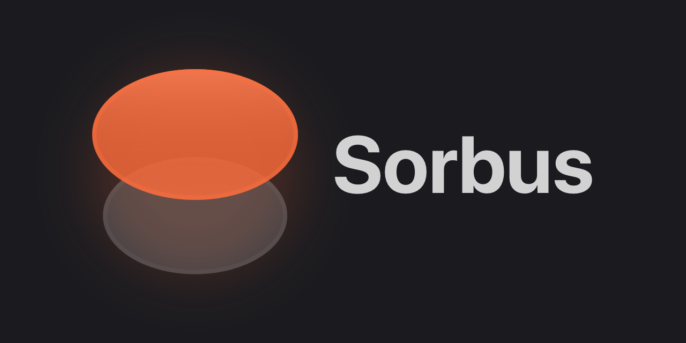

# Sorbus



---

> 🚧 **Sorbus is pre-1.0 and working toward a stable 1.0.** Minor versions can still bring breaking changes, so follow the [changelog](./CHANGELOG.md).

---

[](https://www.npmjs.com/package/sorbus)
[](https://github.com/skiftle/sorbus/actions/workflows/ci.yml)
[](LICENSE)

Sorbus is a typed fetch client for APIs where you can't share types directly — Rails, Django, Go, Laravel. Instead of verbose OpenAPI specs and opaque code generators, you define your API as a contract: endpoints with Zod schemas. Params, responses, and errors are all inferred.

The contract is just TypeScript — compose schemas, pick fields for forms, reuse them for validation. Write contracts by hand, or generate them with [Apiwork](https://github.com/skiftle/apiwork) from your Rails API.

A thin layer over `fetch`. No codegen. No opaque output.

See https://sorbus.dev for full documentation.

## Install

```bash
npm install sorbus zod
# or
pnpm add sorbus zod
```

## The Contract

```typescript
import { defineContract, defineEndpoint } from 'sorbus';
import * as z from 'zod';

const InvoiceSchema = z.object({
  id: z.string(),
  number: z.string(),
  total: z.number(),
});

const show = defineEndpoint({
  method: 'GET',
  path: '/invoices/:id',
  pathParams: z.object({
    id: z.string(),
  }),
  response: {
    body: z.object({
      invoice: InvoiceSchema,
    }),
  },
});

const create = defineEndpoint({
  method: 'POST',
  path: '/invoices',
  request: {
    body: z.object({
      invoice: InvoiceSchema.pick({
        number: true,
        total: true,
      }),
    }),
  },
  response: {
    body: z.object({
      invoice: InvoiceSchema,
    }),
  },
  errors: [422],
});

export const contract = defineContract({
  endpoints: {
    invoices: {
      show,
      create,
    },
  },
  error: z.object({
    message: z.string(),
    errors: z.record(z.string(), z.array(z.string())).optional(),
  }),
});
```

## The Client

Each endpoint in the contract becomes an Operation on the client — a callable with flat and raw overloads.

```typescript
import { createClient } from 'sorbus';
import { contract } from './contract';

const api = createClient(contract, '/api');

// Errors throw — just use the data
const { invoice } = await api.invoices.show({ id: '123' });

// Catch specific status codes when you need to
const result = await api.invoices.create(
  {
    invoice: {
      number: 'INV-001',
      total: 1000,
    },
  },
  { catch: [422] },
);

if (!result.ok) {
  setErrors(result.data.errors);
  return;
}

result.data.invoice; // fully typed
```

## Status

Under active development.
